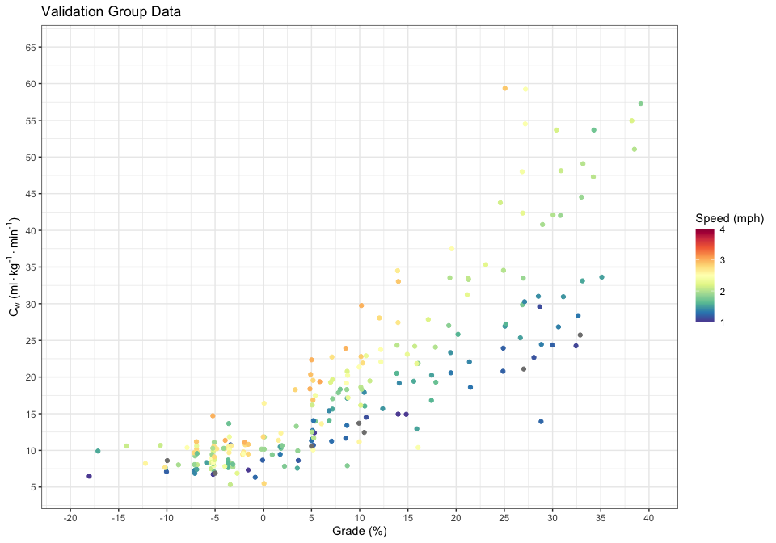

```r
# devtools::install_github("thomasp85/patchwork")

library(tidyverse)
library(broom)
library(RColorBrewer)
library(patchwork)

source("../scripts/_funs.R") # one function to get validation and comparison metrics `valid_detail`
## validation data

dat_validate <- read_csv("../data/dat_validation.csv")
```


```r
myPalette <- colorRampPalette(rev(brewer.pal(11, "Spectral")))

(p_validate <- dat_validate %>% 
  ggplot(aes(x = grade, y = actual_vo2kgml)) +
  geom_jitter(aes(color = speed_actual), height = 0, width = .2) +
  labs(title = "Validation Data", x = "Grade", y = "VO-2 (ml/kg/min)", color = "Speed (mph)") +
  theme_bw() +
  scale_x_continuous(limits = c(-20, 40), breaks = seq(-20, 40, by = 5)) +
  scale_y_continuous(limits = c(5, 65), breaks = seq(0, 65, by = 5)) +
  scale_colour_gradientn(colours = myPalette(100), limits=c(1, 4)))
```

<!-- -->


### Model Comparison in Kj/min values


```r
ct <- tibble(model = c("byui", "acsm", "lcda", "pandolf", "minetti"), params = c(6, 3, 4, 4, 2))

mydata <- bind_rows(
  valid_detail(data = dat_validate, yi = "actual_kjmin", yhat = "byui_kjmin", model_name = "BYU-I", params = filter(ct, model == "byui")$params),
  valid_detail(data = dat_validate, yi = "actual_kjmin", yhat = "acsm_kjmin", grade_filter = 0, model_name = "ACSM", 
               params = filter(ct, model == "acsm")$params),
  valid_detail(data = filter(dat_validate,  !is.na(pandolf_kjmin)), grade_filter = 0, yi = "actual_kjmin", yhat = "pandolf_kjmin", 
               model_name = "Pandolf", params = filter(ct, model == "pandolf")$params),
  valid_detail(data = dat_validate, yi = "actual_kjmin", yhat = "minetti_kjmin", model_name = "Minetti", 
               params = filter(ct, model == "minetti")$params),
  valid_detail(data = dat_validate, yi = "actual_kjmin", yhat = "lcda_kjmin", model_name = "LCDA", 
               params =  filter(ct, model == "lcda")$params))

# checking the lcda and byui for only positive gradients.
# 
# valid_detail(data = dat_validate, yi = "actual_kjmin", yhat = "byui_kjmin", model_name = "BYU-I", grade_filter = 0,
#              params = filter(ct, model == "byui")$params)
#  valid_detail(data = dat_validate, yi = "actual_kjmin", yhat = "lcda_kjmin", model_name = "LCDA", grade_filter = 0,
#               params =  filter(ct, model == "lcda")$params)
```


```r
mydata %>%
  select(Model = model, RMSE = standard_error, R2 = adj_r_sqr) %>%
  knitr::kable(digits = 2)
```


Model       RMSE     R2
--------  ------  -----
BYU-I       5.92   0.89
ACSM        7.22   0.82
Pandolf     8.07   0.78
Minetti    11.71   0.55
LCDA        6.05   0.88


### 

| Model    | Adjusted $R^2$ |
|--------- |----------------|
|Lankford kj/min | 0.89|
|Pandolf kj/min| 0.78|
|Minetti kj/min | 0.55|
|LCDA kj/min | 0.88|


## Residual Plots

### Lankford


```r
pdat_byui <- tibble(x = dat_validate$actual_kjmin, y = valid_detail(data = dat_validate, yi = "actual_kjmin", yhat = "byui_kjmin", 
                                                               params =  filter(ct, model == "byui")$params, resid_out = TRUE))
sd_byui <- sd(pull(pdat_byui, y))

p_byui <- pdat_byui %>%
  ggplot(aes(x,y)) +
  geom_point() +
  geom_hline(yintercept = 0) +
  geom_hline(yintercept = c(sd_byui, -sd_byui), lty = "dashed") +
  theme_bw() +
  scale_y_continuous(limits = c(-35, 45)) +
  labs(x = "Actual (kj/min)", y = "Predicted (kj/min) residual",  title = "Lankford model")

### LCDA
pdat_lcda <- tibble(x = dat_validate$actual_kjmin, y = valid_detail(data = dat_validate, yi = "actual_kjmin", yhat = "lcda_kjmin", 
                                                               params = filter(ct, model == "lcda")$params, resid_out = TRUE))
sd_lcda <- sd(pull(pdat_lcda, y))

p_lcda <- pdat_lcda %>%
  ggplot(aes(x,y)) +
  geom_point() +
  geom_hline(yintercept = 0) +
  geom_hline(yintercept = c(sd_lcda, -sd_lcda), lty = "dashed") +
  theme_bw() +
  scale_y_continuous(limits = c(-35, 45)) +
  labs(x = "Actual (kj/min)", y = "Predicted (kj/min) residual", title = "LCDA model")

### ACSM (no negative grades)

pdat_acsm <- tibble(x = dat_validate %>% filter(grade > 0) %>% pull(actual_kjmin), 
               y = valid_detail(data = dat_validate, yi = "actual_kjmin", yhat = "acsm_kjmin", grade_filter = 0,
                                params = filter(ct, model == "acsm")$params, resid_out = TRUE))
sd_acsm <- sd(pull(pdat_acsm, y))

p_acsm <- pdat_acsm %>%
  ggplot(aes(x,y)) +
  geom_point() +
  geom_hline(yintercept = 0) +
  geom_hline(yintercept = c(sd_acsm, -sd_acsm), lty = "dashed") +
  theme_bw() +
  scale_y_continuous(limits = c(-35, 45)) +
  labs(x = "Actual (kj/min)", y = "Predicted (kj/min) residual",  title = "ACSM model")

### Pandolf

pdat_pandolf <- tibble(x = dat_validate$actual_kjmin, 
               y = valid_detail(data = dat_validate, yi = "actual_kjmin", yhat = "pandolf_kjmin", 
                                params = filter(ct, model == "pandolf")$params, resid_out = TRUE), grade_filter = 0)
sd_pandolf <- sd(pull(pdat_pandolf, y))

p_pandolf <- pdat_pandolf %>%
  ggplot(aes(x,y)) +
  geom_point() +
  geom_hline(yintercept = 0) +
  geom_hline(yintercept = c(sd_pandolf, -sd_pandolf), lty = "dashed") +
  theme_bw() +
  scale_y_continuous(limits = c(-35, 45)) +
  labs(x = "Actual (kj/min)", y = "Predicted (kj/min) residual",  title = "Pandolf model")

### Minetti

pdat_minetti <- tibble(x = dat_validate$actual_kjmin, 
               y = valid_detail(data = dat_validate, yi = "actual_kjmin", yhat = "minetti_kjmin", 
                                params = filter(ct, model == "minetti")$params, resid_out = TRUE))
sd_minetti <- sd(pull(pdat_minetti, y))

p_minetti <- pdat_minetti %>%
  ggplot(aes(x,y)) +
  geom_point() +
  geom_hline(yintercept = 0) +
  geom_hline(yintercept = c(sd_minetti, -sd_minetti), lty = "dashed") +
  theme_bw() +
  scale_y_continuous(limits = c(-35, 45)) +
  labs(x = "Actual (kj/min)", y = "Predicted (kj/min) residual",  title = "Minetti model")


ggsave(plot = p_lcda, filename = "../images_highres/lcda_altman.png", dpi = 300, width = 5, height = 5)
ggsave(plot = p_byui, filename = "../images_highres/lankford_altman.png", dpi = 300, width = 5, height = 5)
ggsave(plot = p_minetti, filename = "../images_highres/minetti_altman.png", dpi = 300, width = 5, height = 5)
ggsave(plot = p_acsm, filename = "../images_highres/acsm_altman.png", dpi = 300, width = 5, height = 5)
ggsave(plot = p_pandolf, filename = "../images_highres/pandolf_altman.png", dpi = 300, width = 5, height = 5)
```


```r
p_validate + 
  theme(legend.position = "bottom") + 
  p_byui + p_minetti + p_acsm + p_pandolf + p_lcda  + 
  plot_annotation(title = "Validation data & Bland-Altman plots for BYU-I, Minetti, ACSM, Pandolf, and LCDA models")
```

<!-- -->
