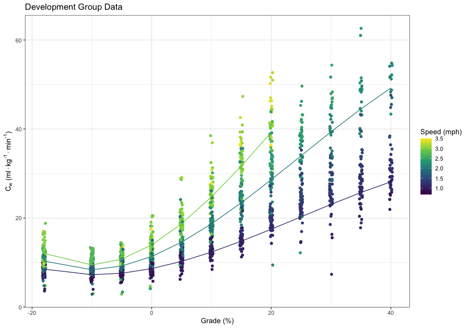

```r
library(tidyverse)
library(broom)
library(pwr)

## model objects

pr_model <- read_rds(path = "../data/polinomial_regression_model.rds")
pr_model_ms <- read_rds(path = "../data/polinomial_regression_model_metersecond.rds")

model_data <- read_csv("../data/training_model_data.csv" )
model_fixedspeeds_plot <- read_csv("../data/fixedspeeds_plot_data.csv" )

## training data

dat_model <- read_csv("../data/dat_model.csv")  
```

## Power Calculations


```r
powercalc <- pwr.f2.test(sig.level = .01, power = .99, f2 = 0.025, u = 6)
n_design <- ceiling(powercalc$v) + powercalc$u
```

Cohen's effect size calculation is $f2 = r^2 / (1  - r^2)$ where values around $0.02$ are used to be able to detect small effects.  We used $0.025$ or the ability to identify an $r^2$ slightly smaller than $0.025$. This resulted in a desired sample size of $n = 1409$


## Modeling 

### Graphic of Our Model


```r
dat_model %>% 
  ggplot(aes(x = grade, y = actual_vo2kgml)) +
  geom_jitter(aes(color = speed_actual), height = 0, width = .25) +
  scale_color_viridis_c() +
  geom_line(data = model_fixedspeeds_plot, aes(y = .fitted, color  = speed_actual, group = factor(speed_actual))) +
  labs(title = "Metabolic Efficiency Training Data", x = "Grade", y = "VO-2 (ml/kg/min)", color = "Speed (mph)") +
  theme_bw()
```

<!-- -->

```r
cc <- pr_model$coefficients
eqn <- paste("Y =", paste(round(cc[1],5), paste(round(cc[-1],5), names(cc[-1]), sep=" * ", collapse=" + "), sep=" + "))
```

Here is the equation

Y = 5.43483 + 2.89406 * speed_actual + -0.05372 * grade + 0.2916 * speed_actual:grade + 0.01062 * speed_actual:I(grade^2) + -0.00014 * speed_actual:I(grade^3)


### Summary of Our Model

In miles per hour.


```r
broom::glance(pr_model) %>%
  knitr::kable(digits = 2)
```


 r.squared   adj.r.squared   sigma   statistic   p.value   df     logLik       AIC       BIC   deviance   df.residual
----------  --------------  ------  ----------  --------  ---  ---------  --------  --------  ---------  ------------
      0.93            0.93    2.92     4218.76         0    6   -4007.01   8028.02   8065.71   13681.03          1604


```r
summary(pr_model) %>%
  tidy() %>%
  bind_cols(confint_tidy(pr_model)) %>%
  knitr::kable(digits = 5)
```


term                       estimate   std.error   statistic   p.value   conf.low   conf.high
------------------------  ---------  ----------  ----------  --------  ---------  ----------
(Intercept)                 5.43483     0.22500    24.15530   0.00000    4.99351     5.87614
speed_actual                2.89406     0.10780    26.84615   0.00000    2.68261     3.10551
grade                      -0.05372     0.01398    -3.84238   0.00013   -0.08114    -0.02630
speed_actual:grade          0.29160     0.00682    42.77277   0.00000    0.27823     0.30498
speed_actual:I(grade^2)     0.01062     0.00026    41.10077   0.00000    0.01012     0.01113
speed_actual:I(grade^3)    -0.00014     0.00001   -16.11110   0.00000   -0.00016    -0.00013


In meters per second


```r
broom::glance(pr_model_ms) %>%
  knitr::kable(digits = 2)
```


 r.squared   adj.r.squared   sigma   statistic   p.value   df     logLik       AIC       BIC   deviance   df.residual
----------  --------------  ------  ----------  --------  ---  ---------  --------  --------  ---------  ------------
      0.93            0.93    2.92     4218.76         0    6   -4007.01   8028.02   8065.71   13681.03          1604


```r
summary(pr_model_ms) %>%
  tidy() %>%
  bind_cols(confint_tidy(pr_model)) %>%
  knitr::kable(digits = 5)
```


term                                   estimate   std.error   statistic   p.value   conf.low   conf.high
------------------------------------  ---------  ----------  ----------  --------  ---------  ----------
(Intercept)                             5.43483     0.22500    24.15530   0.00000    4.99351     5.87614
speed_actual_metersecond                6.47383     0.24115    26.84615   0.00000    2.68261     3.10551
grade                                  -0.05372     0.01398    -3.84238   0.00013   -0.08114    -0.02630
speed_actual_metersecond:grade          0.65230     0.01525    42.77277   0.00000    0.27823     0.30498
speed_actual_metersecond:I(grade^2)     0.02376     0.00058    41.10077   0.00000    0.01012     0.01113
speed_actual_metersecond:I(grade^3)    -0.00032     0.00002   -16.11110   0.00000   -0.00016    -0.00013
